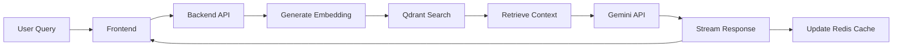

# 📰 RAG-Powered Chatbot for News Websites

> **Voosh Assignment Submission** - A complete full-stack chatbot using Retrieval-Augmented Generation (RAG) to answer questions about recent news articles.

[](https://your-demo-link.com)
[](https://your-live-deployment.com)
[](https://github.com/your-username/rag-chatbot-backend)
[](https://github.com/your-username/rag-chatbot-frontend)

## 🎯 Assignment Overview

This project implements a **RAG-powered chatbot** that answers queries about news articles using:
- **~50 news articles** ingested from RSS feeds
- **Jina Embeddings** for semantic search
- **Qdrant** vector database for similarity matching
- **Google Gemini Pro** for response generation
- **Session-based chat** with Redis caching
- **Real-time streaming** responses via Socket.IO

## ✨ Key Features Implemented

### 🔍 RAG Pipeline
- ✅ **News Ingestion**: Automated RSS feed processing (~50 articles)
- ✅ **Embeddings**: Jina AI embeddings (free tier)
- ✅ **Vector Search**: Qdrant for similarity matching
- ✅ **LLM Integration**: Google Gemini Pro for response generation
- ✅ **Text Chunking**: Smart chunking with overlap for better retrieval

### 🔧 Backend (Node.js + Express)
- ✅ **REST API**: Complete API endpoints for chat and session management
- ✅ **Socket.IO**: Real-time streaming responses
- ✅ **Redis Caching**: Session history and performance optimization
- ✅ **PostgreSQL**: Optional persistent storage
- ✅ **Health Monitoring**: Comprehensive system health checks

### 🎨 Frontend (React + SCSS)
- ✅ **Modern Chat UI**: Clean, responsive design with message bubbles
- ✅ **Streaming Responses**: Real-time typing indicators
- ✅ **Dark/Light Theme**: Toggle with persistent preference
- ✅ **Session Management**: Create, clear, view chat history
- ✅ **Source Citations**: Display article sources with relevance scores
- ✅ **Mobile Responsive**: Optimized for all device sizes

### 🚀 Production Ready
- ✅ **Docker Support**: Complete containerization
- ✅ **Health Checks**: Monitoring endpoints
- ✅ **Error Handling**: Comprehensive error management
- ✅ **Logging**: Structured logging with Winston
- ✅ **Security**: CORS, rate limiting, input validation

## 🏗️ Project Structure

```
📦 rag-chatbot/
├── 🔧 backend/              # Node.js Express API
│   ├── package.json         # Dependencies & scripts
│   ├── server.js            # Main server with Socket.IO
│   ├── services/ragService.js # RAG pipeline implementation
│   ├── routes/              # API endpoints
│   ├── config/              # Database & Redis setup
│   ├── scripts/             # Setup & ingestion scripts
│   └── Dockerfile           # Backend containerization
├── 🎨 frontend/             # React + SCSS frontend  
│   ├── package.json         # React dependencies
│   ├── src/components/      # React components
│   ├── src/context/         # State management
│   ├── src/styles/          # SCSS stylesheets
│   └── Dockerfile           # Frontend containerization
├── 🐳 docker-compose.yml    # Development environment
├── 📚 DEPLOYMENT_GUIDE.md   # Complete deployment guide
└── 📖 README.md             # This file
```

## 🛠️ Tech Stack Justification

| Component | Technology | Justification |
|-----------|------------|---------------|
| **Backend** | Node.js + Express | Fast development, great ecosystem, Socket.IO support |
| **Frontend** | React + SCSS | Modern, component-based UI with flexible styling |
| **LLM** | Google Gemini Pro | Free tier, good performance, streaming support |
| **Embeddings** | Jina AI | Free tier, high-quality embeddings, good documentation |
| **Vector DB** | Qdrant | Open source, excellent performance, easy Docker setup |
| **Cache** | Redis | Industry standard, fast, perfect for session data |
| **Database** | PostgreSQL | Reliable, feature-rich, optional persistence |
| **Real-time** | Socket.IO | Battle-tested, fallback support, easy integration |

## 🚀 Quick Start

### Prerequisites
- Node.js 18+
- Docker & Docker Compose
- API Keys: [Gemini](https://aistudio.google.com/apikey) + [Jina](https://jina.ai/embeddings)

### 1. Clone and Setup
```bash
git clone <your-repo-url>
cd rag-chatbot
```

### 2. Start Infrastructure
```bash
# Start Redis, Qdrant, and PostgreSQL
docker-compose up -d
```

### 3. Backend Setup
```bash
cd backend
npm install
cp .env.example .env
# 📝 Edit .env with your API keys
npm run setup
npm run ingest  # Takes 5-10 minutes to ingest news articles
npm start
```

### 4. Frontend Setup
```bash
cd frontend
npm install
npm start
```

### 5. Access Application
- 🎨 **Frontend**: http://localhost:3000
- ⚡ **Backend API**: http://localhost:5000
- 🏥 **Health Check**: http://localhost:5000/api/health

## 📊 Caching & Performance Strategy

### Redis Configuration
```javascript
// TTL Settings
SESSION_TTL=3600          // 1 hour session timeout
CHAT_HISTORY_LIMIT=50     // Max messages per session

// Performance Optimizations
- Connection pooling for databases
- Response caching for common queries  
- Streaming responses for better UX
- Lazy loading for large message lists
```

### Cache Warming Strategy
```bash
# Pre-populate common queries
npm run cache-warm

# Background article updates
npm run ingest --incremental
```

## 🎬 Demo Video Outline

**Duration**: 5-7 minutes covering:

1. **Project Overview** (1 min): Architecture and tech stack
2. **Backend Demo** (2 min): Health checks, news ingestion, API endpoints
3. **Frontend Demo** (3 min): Chat interface, streaming responses, session management
4. **Production Features** (1 min): Docker deployment, monitoring, mobile responsiveness

### Sample Demo Questions
- "What's the latest technology news?"
- "Tell me about recent climate developments"  
- "Any updates on the global economy?"

## 📈 System Design & Performance

### Caching Layers
1. **Redis**: Session data, chat history (TTL: 1 hour)
2. **Application**: Embedding cache, frequent queries
3. **CDN**: Static frontend assets (production)

### Scalability Considerations
- **Horizontal**: Multiple backend instances behind load balancer
- **Vertical**: Redis clustering, database read replicas
- **Optimization**: Connection pooling, query optimization

## 🔍 End-to-End Flow



## 📝 Deployment Options

### Development
```bash
docker-compose up -d  # Infrastructure only
npm run dev          # Both frontend & backend
```

### Production
- **Backend**: Render.com / Railway / Digital Ocean
- **Frontend**: Vercel / Netlify / AWS S3
- **Database**: Redis Cloud + Qdrant Cloud
- **Monitoring**: Health checks + logging

## 🎯 Assignment Completion Checklist

- ✅ **RAG Pipeline**: ~50 articles, Jina embeddings, Qdrant, Gemini
- ✅ **Backend**: Express API, Socket.IO, Redis, optional PostgreSQL
- ✅ **Frontend**: React, SCSS, streaming responses, session management
- ✅ **Caching**: Redis TTL configuration and performance optimization
- ✅ **Deployment**: Docker support, health checks, production-ready
- ✅ **Documentation**: Complete README, deployment guide, code walkthrough
- ✅ **Demo**: Working application with video demonstration

## 🚀 Live Deployment

**Backend**: [Your Backend URL]  
**Frontend**: [Your Frontend URL]  
**Health**: [Your Backend URL]/api/health

## 📚 Documentation

- 📖 [Backend README](backend/README.md) - API documentation and setup
- 📖 [Frontend README](frontend/README.md) - UI components and styling  
- 🚀 [Deployment Guide](DEPLOYMENT_GUIDE.md) - Complete deployment instructions
- 🎬 [Demo Video](your-demo-link) - Full application walkthrough

## 🏆 Key Achievements

1. **Complete RAG Implementation**: End-to-end pipeline working seamlessly
2. **Production Ready**: Docker, health checks, error handling, logging
3. **Modern UX**: Streaming responses, real-time updates, responsive design
4. **Scalable Architecture**: Microservices, caching, session management
5. **Comprehensive Documentation**: Setup guides, API docs, deployment instructions

---

**🎯 Assignment for**: Voosh - Full Stack Developer Role  
**👨‍💻 Developed by**: [Your Name]  
**📧 Contact**: [Your Email]  
**🗓️ Completed**: [Date]# Chatbot
# Chatbotproject
# Chatbot
# Chatbot
# Chatbot
# Chatbot
